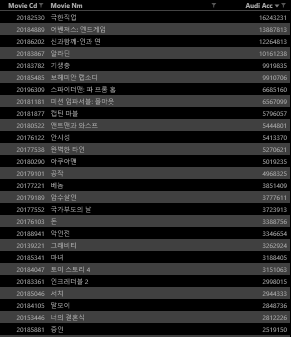
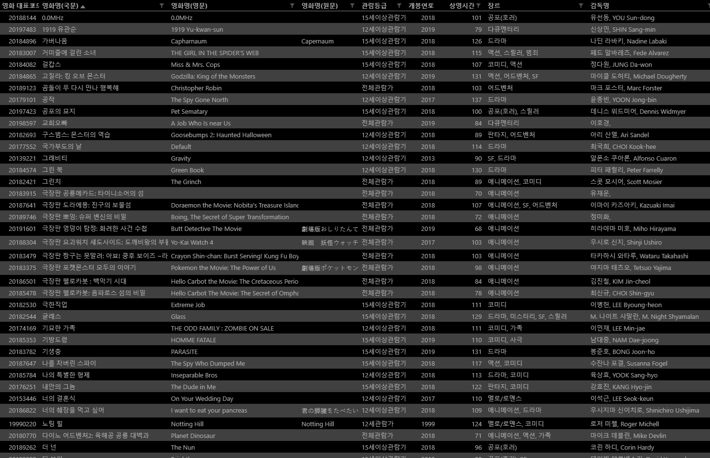
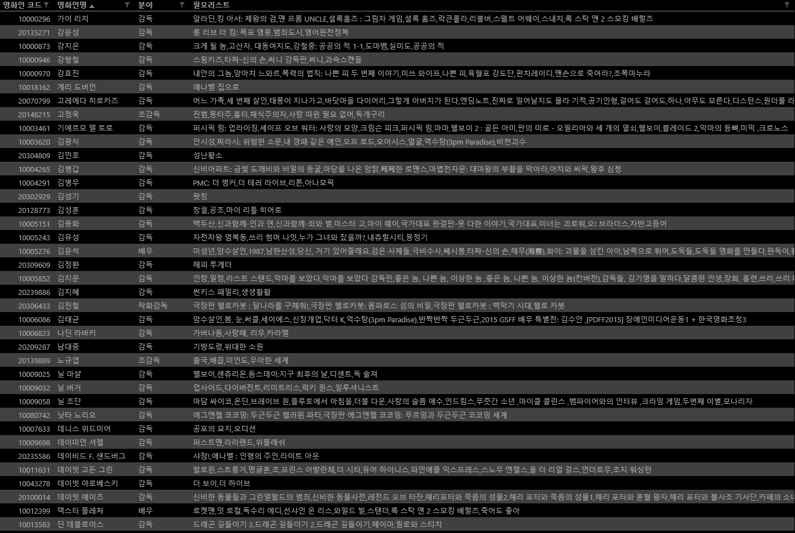

# 01 파이썬을 활용한 데이터 수집Ⅰ

## 01. 주간/주말 박스오피스 데이터

* 요청 조건
  1. 주간(월~일)까지 기간의 데이터를 조회합니다.
  2. 조회 기간은 총 50주이며, 기준일(마지막 일자)은 2019년 7월 13일입니다.
  3. 다양성 영화/상업 영화를 모두 포함하여야 합니다.
  4. 한국/외국 영화를 모두 포함하여야 합니다.
  5. 모든 상영지역을 포함하여야 합니다.
* 결과
  * 수집된 데이터에서 `영화 대표코드`, `영화명`, `해당일 누적관객수`를 기록합니다.
  * `해당일 누적관객수`는 중복시 최신 정보를 반영하여야 합니다.
  * 해당 결과를 **boxoffice.csv**에 저장합니다.

### 01 - 1. datetime

```python
import datetime
for i in range(50):
    mod_time = base_time - datetime.timedelta(weeks=i)
```

* `datetime.timedelta`를 이용하여 쉽게 기준일로부터 최근 50주를 알아낼 수 있다.

* `datetime.timedelta(week=i)` : 주 단위로 더하거나 뺀 날짜를 알 수 있다.

* `datetime.timedelta(month=i)` : 월 단위로 더하거나 뺀 날짜를 알 수 있다.

* `datetime.timedelta(day=i)` : 일 단위로 더하거나 뺀 날짜를 알 수 있다.

* `datetime.now()` : 현재 날짜와 시간을 확인할 수 있다.

  

### 01 - 2. csv 파일 쓰기(만들기)

```python
with open('boxoffice.csv', 'w', encoding='utf-8') as f:
    fieldnames = ['movieCd', 'movieNm', 'audiAcc']
    csv_writer = csv.DictWriter(f, fieldnames=fieldnames)
    csv_writer.writeheader()
    movie_cd = [] # 중복되는 것이 나올 경우 최신정보로 유지하기 위한 방법
    for item in movie_box_week:
        if item['movieCd'] not in movie_cd:
            csv_writer.writerow(item)
            movie_cd.append(item['movieCd'])
```

* `with open() as ~`를 사용하여 csv 파일을 읽고 쓸 수 있다.
* csv 파일의 경우 `fieldnames`를 지정하여 데이터를 보기 쉽게 정리할 수 있다.
* 주어지는 자료가 dictionary일 경우에는 `.items()`를 이용하여 `value`값을 불러온 후에 쓰도록 할 수 있다.

### 01 - 3. 결과



* 총 186개

## 02. 영화 상세정보

* 결과

  * 영화별로 다음과 같은 내용을 저장합니다.

    `영화 대표코드`, `영화명(국문)`, `영화명(영문)`, `영화명(원문)`, `관람등급`, `개봉연도`, `상영시간`, `장르`, `감독명`

  * 해당 결과를 **moive.csv**에 저장합니다.

### 02 - 1. 자주 사용하는 부분은 변수로 저장하여 활용

```python
movie_if = response['movieInfoResult']['movieInfo']
```

* 길게 반복되는 경로는 변수에 저장하여 짧게 사용하면 코드를 확인하거나 수정하기 용이하다.

### 02 - 2. 예외 처리

```python
for mov in movie_cd:
    movie_data[mov] = {'영화 대표코드' : movie_if.get('movieCd'),
                       '영화명(국문)' : movie_if.get('movieNm'),
                       '영화명(영문)' : movie_if.get('movieNmEn'),
                       '영화명(원문)' : movie_if.get('movieNmOg'),
                       '관람등급' : movie_if.get('audits')[0].get('watchGradeNm') if movie_if.get('audits') else None,
                       '개봉연도' : movie_if.get('prdtYear'),
                       '상영시간' : movie_if.get('showTm'),
                       '장르' : genre,
                       '감독명' : director
                    }
```

* `'관람등급' : movie_if.get('audits')[0].get('watchGradeNm')` 부분은 영화에 따라 인덱스 오류가 발생할 수 있기 때문에, **`if movie_if.get('audits') else None`**을 입력하여 `movie_if.get('audits')`에 **자료가 존재하지 않을 경우** `None`을 입력한다.

### 02 - 3. csv 파일 읽기(readlines())

```python
with open('boxoffice.csv', 'r', encoding='utf-8') as f:
    movie_cd = []
    for line in f.readlines():
        if line.split(',')[0] != '\n' and line.split(',')[0].isdigit():
            movie_cd.append(line.split(',')[0])
```

* `.readlines()`를 통해 파일의 내용을 읽어올 수 있다.
* csv 파일은 읽어올 때 `,`로 구분되어 있기 때문에 `.split(',')`를 통해 분리하는 작업이 필요하다.
* **주의! 입력된 내용 안에도 `,`가 있을 경우에는 그 부분도 나뉘어 리스트에 저장된다.**

### 02 - 4. 결과




## 03. 영화인 정보

* 요청 조건

  * `영화인명`으로 조회합니다.

* 결과

  * 영화인별로 다음과 같은 내용을 저장합니다.

    `영화인 코드`, `영화인명`, `분야`, `필모리스트`

  * 해당 결과를 **director.csv**에 저장합니다.

### 03 - 1. csv 파일 읽기(csv.DictReader())

```python
director_name = []
with open('movie.csv', 'r', encoding='utf-8') as f:
    reader = csv.DictReader(f)
    for row in reader:
        director_name.append(((row['감독명'].split(', '))[0], row['영화명(국문)']))
```

* `csv.DictReader()`를  이용하면 `readlines()`보다 편하게 데이터를 가져올 수 있다.
* `readlines`를 사용할 경우 데이터를 정리하는 후작업을 거쳐야하지만 `csv.DictReader()`를 사용할 경우 필요한 항목만 가져올 수 있다.

### 03 - 2. 정확성에 대한 고려

* 영화인명을 통한 정보를 요청할 때 정확성을 높이기 위해서 처음 가져온 영화명과 영화인명을 동시에 보냈다.

```python
with open('movie.csv', 'r', encoding='utf-8') as f:
    reader = csv.DictReader(f)
    for row in reader:
        director_name.append(((row['감독명'].split(', '))[0], row['영화명(국문)']))
```

* 조건식을 이용하여 요청한 내용이 없을 경우 나타날 오류에 대비한다.

```python
man = response.get('peopleListResult').get('peopleList')[0] if response.get('peopleListResult').get('peopleList') else None
director_pool[peopleNm[0]] = {
    '영화인 코드' : man.get('peopleCd') if man.get('peopleCd') else None,
    '영화인명' : man.get('peopleNm') if man.get('peopleNm') else None,
    '분야' : man.get('repRoleNm') if man.get('repRoleNm') else None,
    '필모리스트' : ','.join(man.get('filmoNames').split('|')) if man.get('filmoNames') else None
} if response.get('peopleListResult').get('peopleList') else None
```

* 조건식을 사용하여 예외 처리를 간단하게 할 수 있다.

### 03 - 3. 결과



* 감독 이름과 함께 앞에서 수집한 영화 제목도 같이 입력하여 영화인 정보를 요청하여 정확도를 높여보려고 했다.

## 04. API 정보

### 04 - 1. 주간/주말 박스오피스

#### 요청

> 기본 URL 구조

```
http://www.kobis.or.kr/kobisopenapi/webservice/rest/boxoffice/searchWeeklyBoxOfficeList.json?key={key}&targetDt={targetDt}
```

*  주간/주말 박스오피스 정보에 대해 요청을 보내기 위한 기본 양식
* `key`와 `targetDt`는 **필수값**으로 입력하지 않으면 요청에 대한 응답을 받을 수 없다.
  * `weekGb` : 주간/주말/주중을 선택 입력할 수 있다.
    * 0 : 주간(월~일)
    * 1 : 주말(금~일) => default
    * 2 : 주중 (월~목)
  * `itemPerPage` : 결과 ROW의 개수를 지정한다.(최대 10개 = default)
  * `multiMovieYn` : 다양성 영화/상업영화를 구분지어 조회할 수 있다. (default = 전체)
    * Y : 다양성 영화
    * N : 상업영화
  * `repNationCd` : 한국/외국 영화별로 조회할 수 있다.(default = 전체)
    * K : 한국영화
    * F : 외국영화
  * `wideAreaCd` : 상영지역별로 조회할 수 있으며, 지역코드는 공통코드 조회 서비스에서 `0105000000`로서 조회된 지역코드. (default = 전체)

#### 응답

* 요청에 대한 응답으로 다음과 같은 정보를 수집할 수 있다. (총 21가지)

|   응답 필드   |   값   |                             설명                             |
| :-----------: | :----: | :----------------------------------------------------------: |
| boxofficeType | 문자열 |                박스오피스 종류를 출력합니다.                 |
|     rnum      | 문자열 |                      순번을 출력합니다.                      |
|     rank      | 문자열 |           해당일자의 박스오피스 순위를 출력합니다.           |
|    movieCd    | 문자열 |                영화의 대표코드를 출력합니다.                 |
|    movieNm    | 문자열 |                  영화명(국문)을 출력합니다.                  |
|    openDt     | 문자열 |                 영화의 개봉일을 출력합니다.                  |
|  salesShare   | 문자열 | 해당일자 상영작의 매출총액 대비 해당 영화의 매출비율을 출력합니다. |
|    audiAcc    | 문자열 |                   누적관객수를 출력합니다.                   |

### 04 - 2. 영화 상제정보 조회

#### 요청

> 기본 URL 구조

```
http://www.kobis.or.kr/kobisopenapi/webservice/rest/movie/searchMovieInfo.json?key={key}&movieCd={movieCd}
```

* `key` : 발급받은 키값을 입력한다. (**필수**)
* `movieCd` : 영화 코드를 지정한다. (**필수**)

#### 응답

|  응답 필드   |   값   |            설명             |
| :----------: | :----: | :-------------------------: |
|   movieCd    | 문자열 |   영화코드를 출력합니다.    |
|   movieNm    | 문자열 | 영화명(국문)을 출력합니다.  |
|  movieNmEn   | 문자열 | 영화명(영문)을 출력합니다.  |
|  movieNmOg   | 문자열 | 영화명(원문)을 출력합니다.  |
|   prdtYear   | 문자열 |   제작연도를 출력합니다.    |
|    showTm    | 문자열 |   상영시간을 출력합니다.    |
|    openDt    | 문자열 |   개봉연도를 출력합니다.    |
|   genreNm    | 문자열 |    장르명을 출력합니다.     |
|  directors   | 문자열 |     감독을 나타냅니다.      |
|   peopleNm   | 문자열 |    감독명을 출력합니다.     |
| watchGradeNm | 문자열 | 관람등급 명칭을 출력합니다. |

### 04 - 3. 영화인 정보

#### 요청

> 기본 URL 구조

```
http://www.kobis.or.kr/kobisopenapi/webservice/rest/people/searchPeopleInfo.json?key={key}&peopleCd={peopleCd}
```

* `key` : 발급받은키 값을 입력한다. (**필수**)
* `peopleCd` : 영화인 코드를 지정한다. 

#### 응답

| **응답 필드** | **값** |          **설명**           |
| :-----------: | :----: | :-------------------------: |
|   peopleCd    | 문자열 |  영화인 코드를 출력합니다.  |
|   peopleNm    | 문자열 |   영화인명을 출력합니다.    |
|   repRoleNm   | 문자열 | 영화인 분류명을 출력합니다. |
|    filmos     | 문자열 |  영화인 필모를 나타냅니다.  |

