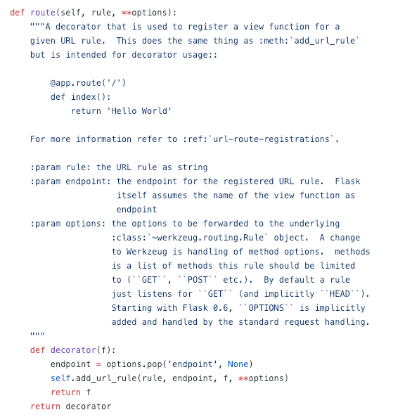
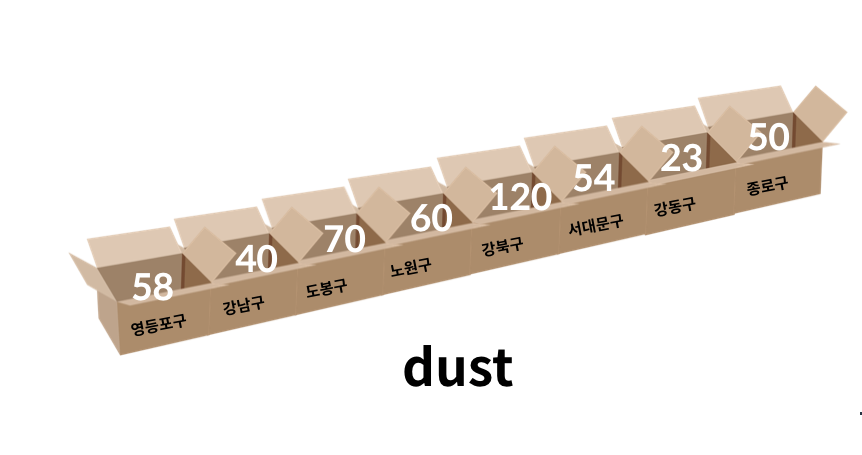

# Python 기초

## 개요

본 강의 자료는 [Python 공식 Tutorial](https://docs.python.org/3.7/tutorial/index.html)에 근거하여 만들어졌으며, Python 3.7버전에 해당하는 내용을 담고 있습니다.

또한, 파이썬에서 제공하는 스타일 가이드인 [`PEP-8`](https://www.python.org/dev/peps/pep-0008/) 내용을 반영하였습니다. 

파이썬을 활용하는 다양한 IT기업들은 대내외적으로 본인들의 스타일 가이드를 제공하고 있습니다. 

* [구글 스타일 가이드](https://github.com/google/styleguide/blob/gh-pages/pyguide.md)
* [Tensorflow 스타일 가이드](https://www.tensorflow.org/community/style_guide)

## 식별자

파이썬에서 식별자는 변수, 함수, 모듈, 클래스 등을 식별하는데 사용되는 이름이다. 

* 식별자의 이름은 영문알파벳, \_, 숫자로 구성된다.
* 첫 글자에 숫자가 올 수 없다. 
* 대소문자를 구별한다.
* 아래의 예약어는 사용할 수 없다. 

```
False, None, True, and, as, assert, break, class, continue, def, del, elif, else, except, finally, for, from, global, if, import, in, is, lambda, nonlocal, not, or, pass, raise, return, try, while, with, yield
```


```python
# 식별자들을 직접 확인해봅시다.
import keyword
print(keyword.kwlist)
```

    ['False', 'None', 'True', 'and', 'as', 'assert', 'async', 'await', 'break', 'class', 'continue', 'def', 'del', 'elif', 'else', 'except', 'finally', 'for', 'from', 'global', 'if', 'import', 'in', 'is', 'lambda', 'nonlocal', 'not', 'or', 'pass', 'raise', 'return', 'try', 'while', 'with', 'yield']
    

*  내장함수나 모듈 등의 이름으로도 만들면 안된다.


```python
# 5를 string으로 바꿔봅시다.
str(5)
```


    '5'


```python
# 예시로 str에 값을 할당해보고, 오류를 확인해봅시다.
str = '문자열!'
```


```python
# 뒤에 코드에 영향이 가니까 변수를 메모리에서 지워줍시다!!!!
str(5)
```


    '5'


```python
list(range(1, 4))
```


    [1, 2, 3]


```python
list = ['김성훈', '연용흠', '박진희']
```


```python
list(range(1, 4))
```


    [1, 2, 3]


```python
# 변수 할당 삭제
del(list)
del(str)
```

## 기초 문법

### 인코딩 선언

인코딩은 선언하지 않더라도 `UTF-8`로 기본 설정이 되어 있다. 

만약, 인코딩을 설정하려면 코드 상단에 아래와 같이 선언한다. 
주석으로 보이지만, Python `parser`에 의해 읽혀진다.

```python
# -*- coding: <encoding-name> -*- 
```

### 주석(Comment)

* 주석은 `#`으로 표현한다. 
* `docstring`은 `"""`으로 표현한다. 
   
   : 여러 줄의 주석을 작성할 수 있으며, 보통 함수/클래스 선언 다음에 해당하는 설명을 위해 활용한다.
   
  
* 예시 : flask 공식 문서 일부 발췌




```python
# 주석을 연습해봅시다. 
```


```python
# 여기는 실행되지 않습니다.
def mysum(a, b):
    ''' 덧셈 함수 입니다.
    이 줄도 실행되지 않아요.
    근데 docstring이라고 부르는 이유가 있습니다.
    아래에서 알아볼게요.
    '''
    return a + b
```


```python
mysum(2, 3)
```


    5


```python
# docstring은 다음과 같이 확인할 수 있습니다.
mysum.__doc__
```


    ' 덧셈 함수 입니다.\n    이 줄도 실행되지 않아요.\n    근데 docstring이라고 부르는 이유가 있습니다.\n    아래에서 알아볼게요.\n    '


### 코드 라인
* 기본적으로 파이썬에서는 `;` 을 작성하지 않는다.

* 한 줄로 표기할 떄는 `;`를 작성하여 표기할 수 있다. 


```python
# print문을 두번 써보자.
print('안녕')
print('하세요!')
```

    안녕
    하세요!
    


```python
# print문을 한줄로 이어서 써봅시다. 오류 메시지를 확인해주세요.
print('안녕')print('하세요!')
```


      File "<ipython-input-19-01c37c967ffb>", line 2
        print('안녕')print('하세요!')
                       ^
    SyntaxError: invalid syntax
    


```python
# ;을 통해 오류를 해결해봅시다.
print('안녕');print('하세요!')
```

    안녕
    하세요!
    

* 줄을 여러줄 작성할 때는 역슬래시`\`를 사용하여 아래와 같이 할 수 있다. 


```python
# print문을 통해 안되는 코드 예시 작성해봅시다.
print('
안녕?')
```


      File "<ipython-input-20-800ea166b0d5>", line 2
        print('
               ^
    SyntaxError: EOL while scanning string literal
    


```python
# print문을 통해 되는 코드 예시 작성해봅시다.
print('\
안녕?')
```

    안녕?
    

* `[]` `{}` `()`는 `\` 없이도 가능하다.


```python
# list를 두 줄에 걸쳐서 만들어봅시다.
lunch = [
    '자장면', '짬뽕', '탕수육',
    '군만두', '물만두', '왕만두'
]

lunch = [
    '자장면',
    '짬뽕'
    ]
```


```python
my_dict = {
    'apple': '사과',
    'banana': '바나나',
    'candy': '사탕'
}
```

# 변수(variable) 및 자료형


<center></center>


<center></center>

* 변수는 `=`을 통해 할당(assignment) 된다. 

* 해당 자료형을 확인하기 위해서는 `type()`을 활용한다.

* 해당 변수의 메모리 주소를 확인하기 위해서는 `id()`를 활용한다.


```python
# 변수에 값을 할당해 봅시다.
a = '안녕?'
```


```python
# type()을 사용해 봅시다.
type(a)
```


    str


```python
# id()를 사용해 봅시다.
id(a)
```


    8190456


```python
b = '안녕?'
```


```python
type(b)
```


    str


```python
id(b)
```


    8190680


* 같은 값을 동시에 할당할 수 있다.


```python
# 같은 값을 동시에 할당해봅시다.
x = y = 1004
```


```python
print(x)
print(y)
```

    1004
    1004
    

* 다른 값을 동시에 할당 가능하다.


```python
# 동시에 두개의 변수에 값 두개를 할당해봅시다.
x, y = 1004, 10002
```


```python
print(x, y)
```

    1004 10002
    


```python
# 변수의 개수가 더 많을 때 오류를 알아봅시다.
a, b, c = 1, 2
```


    ---------------------------------------------------------------------------

    ValueError                                Traceback (most recent call last)

    <ipython-input-40-958a56515ee5> in <module>
          1 # 변수의 개수가 더 많을 때 오류를 알아봅시다.
    ----> 2 a, b, c = 1, 2
    

    ValueError: not enough values to unpack (expected 3, got 2)


```python
# 변수의 개수가 더 적을 때 오류를 알아봅시다.
a, b = 1, 2, 3
```


    ---------------------------------------------------------------------------

    ValueError                                Traceback (most recent call last)

    <ipython-input-41-914bc917c643> in <module>
          1 # 변수의 개수가 더 적을 때 오류를 알아봅시다.
    ----> 2 a, b = 1, 2, 3
    

    ValueError: too many values to unpack (expected 2)


* 이를 활용하면 서로 값을 바꾸고 싶은 경우 아래와 같이 활용 가능하다.


```python
x = 1004
y = 10002
print(x, y)
tmp = y
y = x
x = tmp
print(x, y)
```

    1004 10002
    10002 1004
    


```python
# 변수 x와 y의 값을 바꿔봅시다.
x, y = 1004, 10002
print(x, y)
x, y = y, x
print(x, y)
```

    1004 10002
    10002 1004
    

## 수치형(Numbers)

###  `int` (정수, integer)

모든 정수는 `int`로 표현된다.

파이썬 3.x 버전에서는 `long` 타입은 없고 모두 `int` 형으로 표기 된다.

10진수가 아닌 8진수 : `0o`/2진수 : `0b` /16진수: `0x`로도 표현 가능하다. 


```python
# 변수에 정수를 넣고 해당 변수의 type을 알아봅시다.
a = 3
type(3)
```


    int


```python
# python 3.x에서 long은 없어졌습니다.
# 보통 프로그래밍 언어 및 파이썬 2.x에서의 long은 OS 기준 32/64비트이다.
# 파이썬 3.x에서는 모두 int로 통합되었다.
a = 2**100
print(a)
type(a)
```

    1267650600228229401496703205376
    


    int


```python
b = 0x11
print(b)
c = 0b10
print(c)
d = 0o11
print(d)
```

    17
    2
    9
    

### 오버플로우(overflow)
- 데이터 타입 별로 사용할 수 있는 메모리의 크기가 제한되어 있다.
- 표현할 수 있는 수의 범위를 넘어가는 연산을 하게 되면, 기대했던 값이 출력되지 않는 현상, 즉 메모리가 차고 넘쳐 흐르는 현상

### arbitrary-precision arithmetic
- 파이썬에서 아주 큰 정수를 표현할 때 사용하는 메모리의 크기 변화
- 사용할 수 있는 메모리양이 정해져 있는 기존의 방식과 달리, 현재 남아있는 만큼의 가용 메모리를 모두 수 표현에 끌어다 쓸 수 있는 형태.
- 특정 값을 나타내는데 4바이트가 부족하다면 5바이트, 더 부족하면 6바이트까지 사용 할 수 있게 유동적으로 운용.


```python
# 파이썬에서 가장 큰 숫자를 활용하기 위해 sys 모듈을 불러옵니다.
# 파이썬은 기존 C 계열 프로그래밍 언어와 다르게 정수 자료형에서 오버플로우가 없다.
# arbitrary-precision arithmetic를 사용하기 때문이다. 
import sys
max_int = sys.maxsize
print(max_int)
print(max_int * max_int)
```

    2147483647
    4611686014132420609
    


```python
2**31 - 1
```


    2147483647


```python
# n진수를 만들어보고, 출력 해봅시다.
binary_number = 0b10
octal_number = 0o10
decimal_number = 10
hexdecimal_number = 0x10
print(f'''
2진수 : {binary_number},
8진수 : {octal_number},
10진수 : {decimal_number},
16진수 : {hexdecimal_number}
''')
```

    
    2진수 : 2,
    8진수 : 8,
    10진수 : 10,
    16진수 : 16
    
    

### `float`(부동소수점, 실수)

실수는 `float`로 표현된다. 

다만, 실수를 컴퓨터가 표현하는 과정에서 부동소수점을 사용하며, 항상 같은 값으로 일치되지 않는다. (floating point rounding error)

이는 컴퓨터가 2진수(비트)를 통해 숫자를 표현하는 과정에서 생기는 오류이며, 대부분의 경우는 중요하지 않으나 값을 같은지 비교하는 과정에서 문제가 발생할 수 있다.


```python
# 변수에 실수를 넣고 해당 변수의 type을 알아봅시다.
a = 3.5
type(a)
```


    float


```python
# e를 사용할 수도 있습니다.
b = 314e-2
type(b)
print(b)
```

    3.14
    

* 실수의 경우 실제로 값을 처리하기 위해서는 조심할 필요가 있다.


```python
# 실수의 덧셈을 해봅시다.
1.2 + 4.8
```


    6.0


```python
# 실수의 뺄셈을 해봅시다.
4.8 - 1.12
```


    3.6799999999999997


```python
# 우리가 원하는대로 반올림을 해봅시다.
round(4.8-1.12, 2)
```


    3.68


```python
# 두 개의 값이 같은지 확인해봅시다.
4.8 - 1.12 == 3.68
```


    False


* 따라서 다음과 같은 방법으로 처리 할 수 있다. 이외에 다양한 방법이 있음


```python
# 기본적인 처리방법을 알아봅시다.
a = 3.5 - 3.12 # 0.3799999999999
b = 0.38
```


```python
abs(a - b) <= 1e-10
```


    True


```python
print(1e-10)
```

    1e-10
    


```python
# sys 모듈을 통해 처리하는 방법을 알아봅시다.
import sys
abs(a - b) <= sys.float_info.epsilon
```


    True


```python
print(sys.float_info.epsilon)
```

    2.220446049250313e-16
    


```python
# python 3.5부터 활용 가능한 math 모듈을 통해 처리하는 법을 알아봅시다.
import math
math.isclose(a, b)
```


    True


```python
if abs(a - b) <= 1e-10:
    print('같아요!')
```

    같아요!
    


```python
if a == b:
    print('같아요!')
else:
    print('달라요!')
```

    달라요!
    

### `complex` (복소수)

복소수는 허수부를 `j`로 표현한다. 


```python
# 변수에 복소수를 넣고 해당 변수의 type을 알아봅시다.
a = 3 + 4j
type(a)
```


    complex


```python
# 복소수와 관련된 메소드들을 확인해봅시다.
a.real # 실수부
```


    3.0


```python
a.imag # 허수부
```


    4.0


```python
a.conjugate() # 켤레복소수
```


    (3-4j)


## Bool

파이썬에는 `True`와 `False`로 이뤄진 `bool` 타입이 있다.

비교/논리 연산을 수행 등에서 활용된다.

다음은 `False`로 변환됩니다.
```
0, 0.0, (), [], {}, '', None
```


```python
# True와 False의 타입들을 알아봅시다.
type(True)
```


    bool


```python
type(False)
```


    bool


* 형변환(Type Conversion)에서 추가적으로 다루는 내용입니다.


```python
# 다양한 True, False 상황들을 확인해봅시다.
```


```python
bool(0)
```


    False


```python
bool(1)
```


    True


```python
bool(100)
```


    True


```python
bool(None)
```


    False


```python
bool([])
```


    False


```python
bool('')
```


    False


```python
bool(' ')
```


    True


```python
bool([0])
```


    True


```python
a = ['안녕'] # 값이 존재할 때만 출력
if a:
    print('하이')
```

    하이
    

## None

파이썬에서는 값이 없음을 표현하기 위해 `None`타입이 존재합니다.


```python
# None의 타입을 알아봅시다.
type(None)
```


    NoneType


```python
# 변수에 저장해서 확인해봅시다.
a = None
print(a)
```

    None
    

## 문자형(String)

### 기본 활용법

* 문자열은 Single quotes(`'`)나 Double quotes(`"`)을 활용하여 표현 가능하다. 

* 단, 문자열을 묶을 때 동일한 문장부호를 활용해야하며, `PEP-8`에서는 **하나의 문장부호를 선택**하여 유지하도록 하고 있습니다. 
(Pick a rule and Stick to it)


```python
# 변수에 문자열을 넣고 출력해봅시다.
greetings = 'Hello'
print(greetings)
print(type(greetings))
```

    Hello
    <class 'str'>
    


```python
# 사용자에게 받은 입력은 기본적으로 str입니다
year = input()
print(year)
print(type(year))
```

    2019
    2019
    <class 'str'>
    


```python
year = int(input())
print(year)
print(type(year))
```

    2019
    2019
    <class 'int'>
    


```python
# input 연 월 일으로 들어온다고 하면 다음과 같이 활용하면 편하다.
year, month, day = list(map(int, input().split(' '))) # [2019, 7, 15]
print(year)
print(month)
print(day)
```

    2019 07 15
    2019
    7
    15
    

* 다만 문자열 안에 문장부호(`'`, `"`)가 활용될 경우 이스케이프 문자(`\`)를 사용하는 것 대신 활용 가능 합니다. 


```python
# 문자열 안에 문장부호를 활용해서 오류를 확인해봅시다.
print('용흠이가 말했다. '설문조사 좀 해줄래?'')
```


      File "<ipython-input-2-3e0c663343ed>", line 2
        print('용흠이가 말했다. '설문조사 좀 해줄래?'')
                             ^
    SyntaxError: invalid syntax
    


```python
print('철수가 말했다. "안녕?"')
```

    철수가 말했다. "안녕?"
    


```python
# 오류를 이스케이프 문자와 서로 다른 문장부호를 통해 해결해봅시다.
print('철수가 생각했다. \'배고프다\'')
```

    철수가 생각했다. '배고프다'
    

* 여러줄에 걸쳐있는 문장은 다음과 같이 표현 가능합니다.

`PEP-8`에 따르면 이 경우에는 반드시 `"""`를 사용하도록 되어 있습니다.


```python
# 여러줄을 출력해봅시다.
print('안녕하세요')
print('반갑습니다.')
```

    안녕하세요
    반갑습니다.
    


```python
print('안녕하세요.\n반갑습니다.')
```

    안녕하세요.
    반갑습니다.
    


```python
print("""안녕하세요.
반갑습니다.""")
```

    안녕하세요.
    반갑습니다.
    


```python
# 물론 string interpolation도 가능합니다.
name = '철수'
print(f"""{name} 안녕?
string interpolation도 가능하다!
""")
```

    철수 안녕?
    string interpolation도 가능하다!
    
    

### 이스케이프 문자열

문자열을 활용하는 경우 특수문자 혹은 조작을 하기 위하여 사용되는 것으로 `\`를 활용하여 이를 구분한다. 

|<center>예약문자</center>|내용(의미)|
|:--------:|:--------:|
|\n|줄바꿈|
|\t|탭|
|\r|캐리지리턴|
|\0|널(Null)|
|`\\`|`\`|
|\'|단일인용부호(')|
|\"|이중인용부호(")|


```python
# 이스케이프 문자열을 조합하여 프린트해봅시다.
print('엔터!!\n그리고 탭\t탭')
```

    엔터!!
    그리고 탭	탭
    


```python
print('역슬래시는 이렇게 써야해요. \\')
```

    역슬래시는 이렇게 써야해요. \
    


```python
print('따옴표 \'\"')
```

    따옴표 '"
    

* 이를 출력할 때 활용할 수가 있다.


```python
# print를 하는 과정에서도 이스케이프 문자열을 활용 가능합니다.
print('내용을 옆으로 띄어서 표현하고 싶다.', end='\t')
print('탭탭')
# print는 기본적으로 end='\n'
```

    내용을 옆으로 띄어서 표현하고 싶다.	탭탭
    


```python
# 물론, end 옵션은 이스케이프 문자열이 아닌 다른 것도 가능합니다.
print('개행문자 말고 다른 것도 되는데', end='....')
print('진짜로', end='!')
```

    개행문자 말고 다른 것도 되는데....진짜로!

### String interpolation 

1) `%-formatting` 

2) [`str.format()` ](https://pyformat.info/)

3) [`f-strings`](https://www.python.org/dev/peps/pep-0498/) : 파이썬 3.6 버전 이후에 지원 되는 사항입니다.

`.format()`는 해당 [링크](https://pyformat.info/)에서 확인바랍니다.


```python
# name 변수에 이름을 입력해봅시다.
name = '홍길동'
```


```python
# %-formatting을 활용해봅시다.
'Hello, %s' % name
```


    'Hello, 홍길동'


```python
# str.format()을 활용해봅시다.
'Hello, {}'.format(name)
```


    'Hello, 홍길동'


```python
# f-string을 활용해봅시다.
f'Hello, {name}'
```


    'Hello, 홍길동'


```python
'Hello, ' + name
```


    'Hello, 홍길동'


* f-strings에서는 형식을 지정할 수 있으며,


```python
# 다양한 형식을 활용하기 위해 datetime 모듈로 오늘을 표현해봅시다.
```


```python
import datetime
today = datetime.datetime.now()
print(today)
```

    2019-07-15 13:34:39.815434
    


```python
f'오늘은 {today:%Y}년 {today:%m}월 {today:%d}입니다. {today:%A}입니다. {today:%H} {today:%M} {today:%S}'
```


    '오늘은 2019년 07월 15입니다. Monday입니다. 13 34 39'


* 연산과 출력형식 지정도 가능합니다.


```python
# string interpolation에서 연산과 숫자 출력형식을 지정해봅시다.
pi = 3.141592
f'원주율은 {pi:.2f}이고, 원의 면적은 {pi*2*2:.2f}'
```


    '원주율은 3.14이고, 원의 면적은 12.57'


# 연산자

## 산술 연산자
Python에서는 기본적인 사칙연산이 가능합니다. 

|연산자|내용|
|----|---|
|+|덧셈|
|-|뺄셈|
|\*|곱셈|
|/|나눗셈|
|//|몫|
|%|나머지(modulo)|
|\*\*|거듭제곱|


```python
# 2의 1000승을 확인해봅시다.
2**1000
```


    10715086071862673209484250490600018105614048117055336074437503883703510511249361224931983788156958581275946729175531468251871452856923140435984577574698574803934567774824230985421074605062371141877954182153046474983581941267398767559165543946077062914571196477686542167660429831652624386837205668069376


```python
# 나눗셈과 관련된 산술연산자를 활용해봅시다.
print(5 / 2)
print(5 // 2) # 몫
print(5 % 2) # 나머지
print(int(5/2))
```

    2.5
    2
    1
    2
    


```python
# divmod는 나눗셈과 관련된 함수입니다.
print(divmod(5, 2)) # (몫, 나머지)
quotient, remainder = divmod(5, 2)
print(f'몫은 {quotient}, 나머지는 {remainder}')
```

    (2, 1)
    몫은 2, 나머지는 1
    

* 양수/음수도 표현 가능합니다.


```python
# 음수 양수 표현도 해봅시다.
positive_num = 4
negative_num = -4
print(negative_num)
print(-negative_num)
```

    -4
    4
    

## 비교 연산자

우리가 수학에서 배운 연산자와 동일하게 값을 비교할 수 있습니다.

|연산자|내용|
|----|---|
|a > b|초과|
|a < b|미만|
|a >= b|이상|
|a <= b|이하|
|a == b|같음|
|a != b|같지않음|


```python
# 숫자의 대소관계를 비교해봅시다.
3 > 2
```


    True


```python
# 같은 숫자인지 확인해봅시다.
5 == 5
```


    True


```python
3 != 5
```


    True


```python
# 다른 숫자인지 확인해봅시다.
3.0 == 3
```


    True


```python
# 문자열도 같은지 확인해봅시다.
'hi' == 'hi'
```


    True


```python
'Hi' == 'hi'
```


    False


## 논리 연산자

|연산자|내용|
|---|---|
|a and b|a와 b 모두 True시만 True|
|a or b|a 와 b 모두 False시만 False|
|not a|True -> False, False -> True|

우리가 보통 알고 있는 `&` `|`은 파이썬에서 비트 연산자이다.


```python
# and과 관련해서 모든 case를 출력해봅시다.
print(True and True)
print(True and False)
print(False and True)
print(False and False)
```

    True
    False
    False
    False
    


```python
# or과 관련해서 모든 case를 출력해봅시다.
print(True or True)
print(True or False)
print(False or True)
print(False or False)
```

    True
    True
    True
    False
    


```python
a = 3
b = 6
if a % 2 == 1 and b % 2 == 0:
    print('a홀b짝')
```

    a홀b짝
    


```python
# not을 활용해봅시다.
print(not True)
print(not 0)
```

    False
    True
    

* 파이썬에서 and는 a가 거짓이면 a를 리턴하고, 참이면 b를 리턴한다.
* 파이썬에서 or은 a가 참이면 a를 리턴하고, 거짓이면 b를 리턴한다.


```python
# and의 단축평가(short-circuit evaluation)에 대해서 알아봅시다.
print(3 and 5) # 참 거짓이 판별되는 순간의 값을 반환. 3 and 5
print(3 and 0)
print(0 and 3)
print(0 and [])
```

    5
    0
    0
    0
    


```python
# or의 단축평가(short-circuit evaluation)에 대해서 알아봅시다.
print(5 or 3)
print(3 or 0)
print(0 or 3)
print(0 or [])
```

    5
    3
    3
    []
    

## 복합 연산자

복합 연산자는 연산과 대입이 함께 이뤄진다. 

가장 많이 활용되는 경우는 반복문을 통해서 개수를 카운트하거나 할 때 활용된다.

|연산자|내용|
|----|---|
|a += b|a = a + b|
|a -= b|a = a - b|
|a \*= b|a = a \* b|
|a /= b|a = a / b|
|a //= b|a = a // b|
|a %= b|a = a % b|
|a \*\*= b|a = a ** b|


```python
# 복합연산자는 이럴 때 사용됩니다.
count = 0
while count < 3:
    print(count)
    count += 1 # conut = count + 1 과 동일!!
```

## 기타 연산자

### Concatenation

숫자가 아닌 자료형은 `+` 연산자를 통해 합칠 수 있다.

### Containment Test

`in` 연산자를 통해 속해있는지 여부를 확인할 수 있다.

### Identity

`is` 연산자를 통해 동일한 object인지 확인할 수 있다. 


(나중에 Class를 배우고 다시 학습)

### Indexing/Slicing
`[]`를 통한 값 접근 및 `[:]`을 통한 슬라이싱 

(다음 챕터를 배우면서 추가 학습)


```python
# 문자열끼리 더해봅시다.(합쳐봅시다.)
'Hi, ' + 'SSAFY'
```


    'Hi, SSAFY'


```python
# list끼리 더해봅시다.(합쳐봅시다.)
[1, 2, 3] + ['회', '초밥']
```


    [1, 2, 3, '회', '초밥']


```python
# 문자열안에 특정한 문자가 있는지 확인해봅시다.
'a' in 'apple'
```


    True


```python
# list안에 특정한 원소가 있는지 확인해봅시다.
'hi' in [1, 2, 'hi']
```


    True


```python
# range안에 특정한 원소가 있는지 확인해봅시다.
5 in range(1, 5)
```


    False


```python
# is는 맛만 봅시다.
# 파이썬에서 -5부터 256까지의 id는 동일합니다.  # 속도를 위해서 위치를 고정
a = 3
b = 3
print(a == b)
print(a is b)
```

    True
    True
    


```python
print(id(a), id(b))
```

    1878484096 1878484096
    


```python
# id는 다르죠!
c = 257
d = 257
c is d
```


    False


```python
print(id(c), id(d))
```

    13428656 13428640
    


```python
# 문자열을 인덱싱을 통해 값에 접근해봅시다.
'hi'[0]
```


    'h'


```python
# 마지막 위치에 접근할 때는 -1을 사용해봅시다.
'hi'[-1]
```


    'i'


```python
[1, 2, 3][-1]
```


    3


```python
[0, 1, 2][0:1] # 인덱싱
```


    [0]


```python
[0, 1, 2][1:3]
```


    [1, 2]


## 연산자 우선순위

0. `()`을 통한 grouping

1. Slicing

2. Indexing

3. 제곱연산자
    \*\*

4. 단항연산자 
    +, - (음수/양수 부호)

5. 산술연산자
    \*, /, %
    
6. 산술연산자
    +, -
 
7. 비교연산자, `in`, `is`

8. `not`

9. `and` 

10. `or`


```python
# 우선순위를 확인해봅시다.
if (not ((2**3 * 2 + 5) == 13) or 'a' in 'apple'):
    print('출력')
```

    출력
    

# 기초 형변환(Type conversion, Typecasting)


파이썬에서 데이터타입은 서로 변환할 수 있다.

## 암시적 형변환(Implicit Type Conversion)
사용자가 의도하지 않았지만, 파이썬 내부적으로 자동으로 형변환 하는 경우이다.
아래의 상황에서만 가능하다.
* bool
* Numbers (int, float, complex)


```python
# boolean과 integer는 더할 수 있을까요?
True + 3
```


    4


```python
int(True)
```


    1


```python
# int, float, complex를 각각 변수에 대입해봅시다.
int_num = 3
float_num = 3.5
complex_num = 3 +5j
```


```python
# int와 float를 더해봅시다. 그 결과의 type은 무엇일까요?
result = int_num + float_num
print(result, type(result))
```

    6.5 <class 'float'>
    


```python
# int와 complex를 더해봅시다. 그 결과의 type은 무엇일까요?
result = int_num + complex_num
print(result,type(result))
```

    (6+5j) <class 'complex'>
    

## 명시적 형변환(Explicit Type Conversion)

위의 상황을 제외하고는 모두 명시적으로 형 변환을 해주어야한다.

* string -> intger  : 형식에 맞는 숫자만 가능
* integer -> string : 모두 가능

암시적 형변환이 되는 모든 경우도 명시적으로 형변환이 가능하다.

* `int()` : string, float를 int로 변환
* `float()` : string, int를 float로 변환
* `str()` : int, float, list, tuple, dictionary를 문자열로 변환

`list(), tuple()` 등은 다음 챕터에서 배울 예정이다.


```python
# integer와 string 사이의 관계는 명시적으로 형변환을 해줘야만 합니다.
1 + '등'
```


    ---------------------------------------------------------------------------

    TypeError                                 Traceback (most recent call last)

    <ipython-input-99-304bb1f4d577> in <module>
          1 # integer와 string 사이의 관계는 명시적으로 형변환을 해줘야만 합니다.
    ----> 2 3 + '3'
    

    TypeError: unsupported operand type(s) for +: 'int' and 'str'


```python
str(1) + '등'
```


    '1등'


```python
# string 3을 integer로 변환해봅시다.
int('3')
```


    3


```python
# string 3.5를 float로 변환해봅시다.
float(3.5)
```


    3.5


```python
# string은 글씨가 숫자일때만 형변환이 가능합니다.
int('안녕')
```


    ---------------------------------------------------------------------------

    ValueError                                Traceback (most recent call last)

    <ipython-input-103-4b7636c5683d> in <module>
          1 # string은 글씨가 숫자일때만 형변환이 가능합니다.
    ----> 2 int('안녕')
    

    ValueError: invalid literal for int() with base 10: '안녕'


```python
# string 3.5를 int로 변환할 수는 없습니다.
int('3.5')
```


    ---------------------------------------------------------------------------

    ValueError                                Traceback (most recent call last)

    <ipython-input-105-daee20086ade> in <module>
          1 # string 3.5를 int로 변환할 수는 없습니다.
    ----> 2 int('3.5')
    

    ValueError: invalid literal for int() with base 10: '3.5'


```python
# float 3.5는 int로 변환이 가능합니다.
int(3.5)
```


    3


# 시퀀스(sequence) 자료형

`시퀀스`는 데이터의 순서대로 나열된 형식을 나타낸다. 

**주의! 순서대로 나열된 것이 정렬되었다라는 뜻은 아니다.**

파이썬에서 기본적인 시퀀스 타입은 다음과 같다.

1. 리스트(list)

2. 튜플(tuple)

3. 레인지(range)

4. 문자열(string)

5. 바이너리(binary) : 따로 다루지는 않습니다.


## `list`

<center></center>

**활용법**
```python
[value1, value2, value3]
```

리스트는 대괄호`[]` 를 통해 만들 수 있습니다.

값에 대한 접근은 `list[i]`를 통해 합니다.


```python
# 빈 리스트를 만들어봅시다.
my_list = []
my_list2 = list()
print(type(my_list))
print(type(my_list2))
```

    <class 'list'>
    <class 'list'>
    


```python
# 원소를 포함한 리스트를 만들어봅시다.
location = ['서울', '대전', '구미', '광주', 1, True]
print(location)
print(type(location))
```

    ['서울', '대전', '구미', '광주', 1, True]
    <class 'list'>
    


```python
# 첫번째 값에 접근해봅시다.
location[0]
```


    '서울'


```python
location[4] = '제주'
print(location)
```

    ['서울', '대전', '구미', '광주', '제주', True]
    

## `tuple`

**활용법**
```python
(value1, value2)
```

튜플은 리스트와 유사하지만, `()`로 묶어서 표현합니다.

그리고 tuple은 수정 불가능(immutable)하고, 읽을 수 밖에 없습니다.

직접 사용하는 것보다는 파이썬 내부에서 사용하고 있습니다.


```python
# tuple을 만들어봅시다.
my_tuple = (1, 2)
print(type(my_tuple))
```

    <class 'tuple'>
    


```python
print(my_tuple[0])
```

    1
    


```python
my_tuple[0] = 0 # tuple과 list의 가장 큰 차이점
```


    ---------------------------------------------------------------------------

    TypeError                                 Traceback (most recent call last)

    <ipython-input-116-0e317f35989b> in <module>
    ----> 1 my_tuple[0] = 0
    

    TypeError: 'tuple' object does not support item assignment


```python
# 아래와 같이 만들 수 있습니다.
this_is_tuple = 1, 2
print(this_is_tuple)
print(type(this_is_tuple))
```

    (1, 2)
    <class 'tuple'>
    


```python
# 파이썬 내부에서는 다음과 같이 활용됩니다.
# 앞선 2. 변수 및 자료형 예제에서 사용된 코드입니다.
x, y = 1, 2
print(x, y)
```

    1 2
    


```python
# 실제로는 tuple로 처리됩니다.
x, y = (1, 2)
```


```python
# 변수의 값을 swap하는 코드 역시 tuple을 활용하고 있습니다. 
x, y = y, x
```

##  `range()`

레인지는 숫자의 시퀀스를 나타내기 위해 사용됩니다.

기본형 : `range(n)` 


> 0부터 n-1까지 값을 가짐


범위 지정 : `range(n, m)` 

> n부터 m-1까지 값을 가짐

범위 및 스텝 지정 : `range(n, m, s)`

> n부터 m-1까지 +s만큼 증가한다


```python
# range를 만들어봅시다.
range(5)
```


    range(0, 5)


```python
# range에 담긴 값을 list로 바꿔서 확인해봅시다.
list(range(5))
```


    [0, 1, 2, 3, 4]


```python
# 4 ~ 8까지의 숫자를 담은 range를 만들어봅시다.
range(4, 9)
list(range(4, 9))
```


    [4, 5, 6, 7, 8]


```python
# 0부터 -9까지 담긴 range를 만들어봅시다.
range(-9, 1)
print(list(range(-9, 1)))
print(list(range(0, -10, -1)))
```

    [-9, -8, -7, -6, -5, -4, -3, -2, -1, 0]
    [0, -1, -2, -3, -4, -5, -6, -7, -8, -9]
    


```python
list(range(0, 10, 2))
```


    [0, 2, 4, 6, 8]


## 시퀀스에서 활용할 수 있는 연산자/함수 

|operation|설명|
|---------|---|
|x in s	|containment test|
|x not in s|containment test|
|s1 + s2|concatenation|
|s * n|n번만큼 반복하여 더하기
|s[i]|indexing|
|s[i:j]|slicing|
|s[i:j:k]|k간격으로 slicing|
|len(s)|길이|
|min(s)|최솟값|
|max(s)|최댓값|
|s.count(x)|x의 개수|


```python
# contain test를 확인해봅시다.
3 in [1, 2, 3]
```


    True


```python
# concatenation를 해봅시다.
[1, 2] + ['하이']
```


    [1, 2, '하이']


```python
# 숫자 0이 6개 있는 list를 만들어봅시다.
[0] * 6
```


    [0, 0, 0, 0, 0, 0]


```python
# indexing과 slicing을 하기 위해 list하나를 만들어주세요.
location[0]
```


    '서울'


```python
# 두번쨰, 세번쨰 값만 가져와봅시다.
location[1:3]
```


    ['대전', '구미']


```python
# 0부터 30까지의 숫자를 3씩 증가시킨 상태로 만들어봅시다.
r = list(range(31))
my_list = r[0:len(r):3]
```


```python
# 위에서 만든 list의 길이를 확인해봅시다.
len(my_list)
```


    11


```python
# 위에서 만든 list의 최솟값, 최댓값을 확인해봅시다.
print(min(my_list)) # 최소
print(max(my_list)) # 최대
print(sum(my_list)) # 합
```

    0
    30
    165
    


```python
# list에 담긴 특정한 것의 개수를 확인할 수도 있습니다.
my_list = [1, 2, 1, 1, 3, 5]
my_list.count(1)
```


    3


# set, dictionary

* `set`과 `dictionary`는 기본적으로 순서가 없습니다.

## `set`

세트는 수학에서의 집합과 동일하게 처리됩니다. 

세트는 중괄호`{}`를 통해 만들며, 순서가 없고 중복된 값이 없습니다.

**활용법**
```python
{value1, value2, value3}
```

|연산자/함수|설명|
|---|---|
|a - b|차집합|
|a \| b|합집합|
|a & b|교집합|
|a.difference(b)|차집합|
|a.union(b)|합집합|
|a.intersection(b)|교집합|


```python
# set 두개를 만들어서 연산자들을 활용해봅시다.
set_a = {1, 2, 3}
set_b = {3, 6, 9}
```


```python
print(set_a - set_b)
print(set_a & set_b)
print(set_a | set_b)
```

    {1, 2}
    {3}
    {1, 2, 3, 6, 9}
    


```python
# set은 중복된 값이 있을 수 없습니다.
{1, 1, 3}
```


    {1, 3}


* `set`을 활용하면 `list`의 중복된 값을 손쉽게 제거할 수 있습니다.


```python
# set으로 중복된 값을 제거해봅시다.
my_list = [1, 2, 3, 1, 1]
print(set(my_list))
```

    {1, 2, 3}
    


```python
# 다시 list로 바꿔서 확인해봅시다.
list(set(my_list))
```


    [1, 2, 3]


## `dictionary`

<center></center> 

**활용법**
```python
{Key1:Value1, Key2:Value2, Key3:Value3, ...}
```

* 딕셔너리는 `key`와 `value`가 쌍으로 이뤄져있으며, 궁극의 자료구조입니다. 
* `{}`를 통해 만들며, `dict()`로 만들 수도 있습니다.
* `key`는 immutable한 모든 것이 가능하다. (불변값 : string, integer, float, boolean, tuple, range)
* `value`는 `list`, `dictionary`를 포함한 모든 것이 가능하다.


```python
# 비어있는 dictionary를 두가지 방법으로 만들어봅시다.
dict_a = {}
dict_b = dict()
print(type(dict_a))
print(type(dict_b))
```

    <class 'dict'>
    <class 'dict'>
    


```python
# 지역번호(서울-02 경기-031 인천-032)가 담긴 전화번호부를 만들어봅시다.
phone_book = {'서울': '02', '경기': '031'}
phone_book['서울']
```


    '02'


```python
# dictionary는 중복된 key는 존재할 수가 없습니다.
my_dict = {1: 1, 2: 2, 3: 3, 1: 4}
print(my_dict)
```

    {1: 4, 2: 2, 3: 3}
    


```python
# 딕셔너리의 메소드를 활용하여 key를 확인 해볼 수 있습니다.
my_dict.keys()
```


    dict_keys([1, 2, 3])


```python
# 딕셔너리의 메소드를 활용하여 value를 확인 해볼 수 있습니다.
my_dict.values()
```


    dict_values([4, 2, 3])


# 정리
## 데이터 타입
<center></center>
